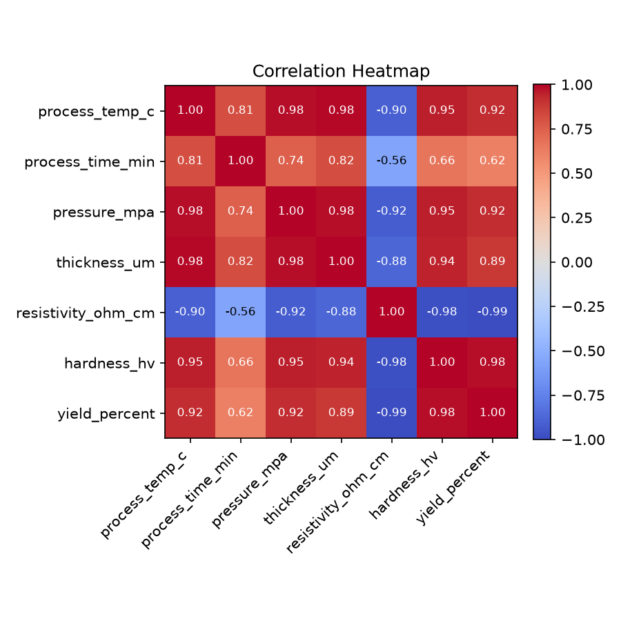
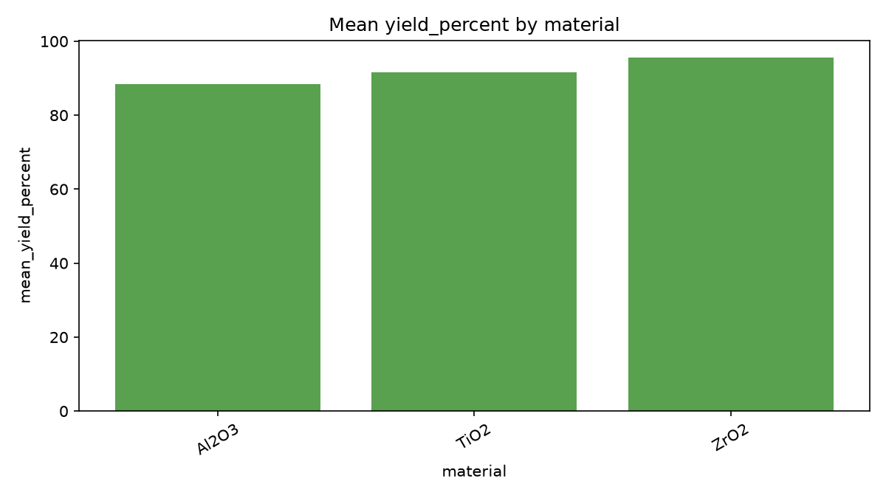
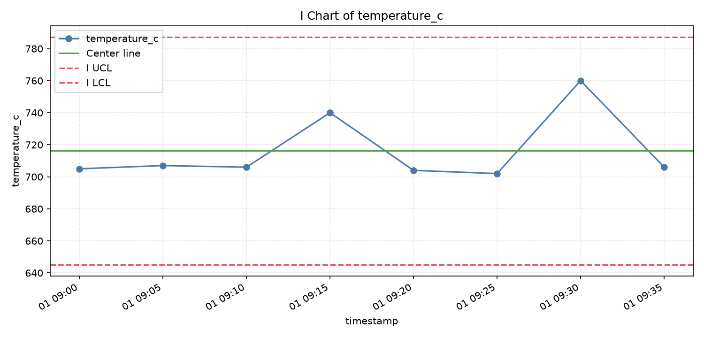
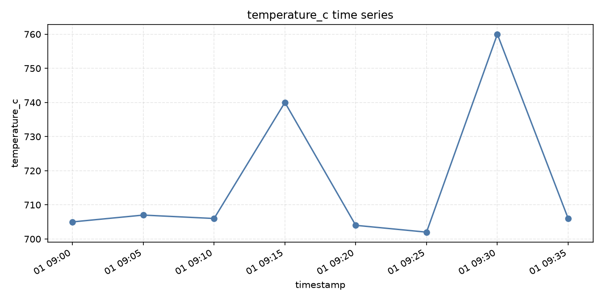

# materials_data_analyzer

[](https://github.com/jhin0410-lgtm/materials-data-analyzer/actions/workflows/ci.yml)

## What This Project Is

`materials_data_analyzer` is a **Tabular Engineering Data Analysis & Virtual Experiment Screening Platform**.

It is a CLI-based analysis platform for CSV-style engineering datasets, including materials experiments, process-condition tables, quality data, reliability records, SPC datasets, and smart-factory-like logs.

The project focuses on this workflow:

```text
CSV engineering data
-> data validation
-> EDA / correlation / groupby analysis
-> target-feature relationship analysis
-> process / reliability / SPC / smart-factory analysis
-> data-driven virtual experiment screening
-> Markdown report generation
```

The simulation workflow is a data-driven screening aid. It uses observed target-feature relationships to compare candidate/scenario conditions. It is not physics simulation and does not replace engineering interpretation or validation experiments.

## Core Workflow

1. Load CSV engineering data.
2. Validate file shape, columns, missingness, duplicate rows, and optional domain constraints.
3. Run EDA, correlation analysis, groupby summaries, and target-feature relationship checks.
4. Run domain-oriented analysis modes such as process, reliability, SPC, or smart-factory log analysis.
5. Run simulation mode for data-driven virtual experiment screening with baseline surrogate modeling and validation diagnostics.
6. Generate processed tables, figures, and Markdown reports under `outputs/{run_name}/`.

## Core Capabilities

- Data validation and readiness reporting
- EDA
- Missing-value and duplicate-row summaries
- Correlation analysis
- Groupby summaries
- Target distribution and target-feature relationship analysis
- Process-condition analysis
- Reliability analysis
- SPC and capability analysis
- Smart-factory log analysis
- Data-driven simulation / virtual experiment screening
- Scenario and candidate condition screening
- Baseline model validation diagnostics
- Markdown report generation

## What This Project Is Not

This project is:

- Not a fully automatic engineering decision system
- Not a production battery degradation model
- Not a general-purpose AutoML platform
- Not a raw data repository
- Not a replacement for engineering interpretation
- Not a physics simulator
- Not a tool for deciding final process conditions without domain review

## Project Structure

```text
src/
  Core platform modules, CLI entry point, analyzers, loaders, connectors,
  data-readiness helpers, reports, and visualization utilities.

src/analyzers/
  Core analyzer modes: eda, process, reliability, smart_factory, spc,
  and simulation.

src/loaders/
  Case-study and dataset preparation utilities. These convert external
  source data into analyzer-ready tabular CSVs.

src/connectors/
  Optional/experimental ingestion layer for external data sources.

scripts/
  Utility scripts for ingestion, inspection, case-study preprocessing,
  and simulation-run comparison.

data/sample/
  Synthetic demonstration CSV files for quickstart and tests.

data/raw/
  Local raw-data staging area. Raw downloaded data should generally not
  be committed.

data/processed/
  Generated or curated case-study summary tables.

data/case_studies/
  Real-data demonstration notes and reports. These are not core analyzer
  modules.

outputs/
  Regenerable analyzer run outputs. These are generally local artifacts
  and are not committed.

tests/
  Pytest suite for the platform, loaders, connectors, scripts, and
  validation helpers.
```

For more detail, see [`docs/PROJECT_STRUCTURE.md`](docs/PROJECT_STRUCTURE.md).

## Quickstart

Install dependencies:

```powershell
python -m venv .venv
.\.venv\Scripts\Activate.ps1
pip install -r requirements.txt
```

Run EDA on the synthetic process dataset:

```powershell
python src/process_data.py --mode eda --input data/sample/experiment_process.csv --run-name demo_eda
```

Run process-condition analysis:

```powershell
python src/process_data.py --mode process --input data/sample/experiment_process.csv --target yield_percent --goal maximize --run-name demo_process
```

Run multi-objective process screening:

```powershell
python src/process_data.py --mode process --input data/sample/experiment_process.csv --targets yield_percent hardness_hv resistivity_ohm_cm --goals maximize maximize minimize --run-name demo_multi_objective
```

Run reliability analysis:

```powershell
python src/process_data.py --mode reliability --input data/sample/experiment_reliability.csv --run-name demo_reliability
```

Run smart-factory log analysis:

```powershell
python src/process_data.py --mode smart_factory --input data/sample/factory_log.csv --run-name demo_smart_factory
```

Run SPC analysis:

```powershell
python src/process_data.py --mode spc --input data/sample/factory_log.csv --target temperature_c --lsl 690 --usl 710 --run-name demo_spc
```

Run simulation mode with a scenario CSV:

```powershell
python src/process_data.py --mode simulation --input data/sample/experiment_process.csv --target yield_percent --features process_temp_c process_time_min pressure_mpa thickness_um --scenario-input data/sample/simulation_scenarios.csv --run-name demo_simulation
```

Run candidate condition screening with the sample candidate table:

```powershell
python src/process_data.py --mode simulation --input data/sample/experiment_process.csv --target yield_percent --features process_temp_C process_time_min pressure_mpa thickness_um --scenario-input data/sample/candidate_conditions.csv --goal maximize --run-name sample_virtual_experiment
```

### Virtual Experiment Screening Quickstart

Use `data/sample/experiment_process.csv` as the training dataset and
`data/sample/candidate_conditions.csv` as the candidate condition table.
The sample candidate table includes `candidate_id`, the required feature
columns, and an extra `note` column that is preserved in the outputs.

The main v0.9 screening outputs are:

- `candidate_predictions.csv`: candidate-level predictions, validation status, and warning counts.
- `candidate_domain_warnings.csv`: feature min/max range warnings based on the training data.
- `candidate_ranking.csv`: goal-based candidate ranking for screening review.
- `simulation_report.md`: Markdown summary of validation, predictions, warnings, ranking, limitations, and suggested next checks.

Run virtual experiment screening without a scenario CSV:

```powershell
python src/process_data.py --mode simulation --input data/sample/experiment_process.csv --target yield_percent --features process_temp_c process_time_min pressure_mpa thickness_um --design-method random --design-samples 100 --run-name demo_virtual_experiment
```

Run tests:

```powershell
python -m pytest
```

## Real-Data Case Studies

The repository currently includes three representative real-data case studies:

- Kaggle NASA Li-ion Battery
- Battery Archive
- Materials Project

These case studies demonstrate source-specific preparation and validation
workflows. They are not the core product identity; the core project remains a
Tabular Engineering Data Analysis & Virtual Experiment Screening Platform.

### Kaggle NASA Li-ion Battery

The Kaggle NASA battery work is a representative real-data case study, not the core product identity.

The case study demonstrates:

- Data quality audit from Kaggle cleaned metadata
- Full audit CSV and analysis-ready CSV separation
- Analysis-ready filtering using `retention_quality_flag`
- Raw discharge CSV feature extraction into scalar cycle-level features
- Random split versus `battery_id` group split validation
- Simulation-run comparison and Markdown reporting

Case-study documents:

- [`data/case_studies/kaggle_battery/case_study.md`](data/case_studies/kaggle_battery/case_study.md)
- [`data/case_studies/kaggle_battery/source.md`](data/case_studies/kaggle_battery/source.md)
- [`data/case_studies/kaggle_battery/simulation_comparison.md`](data/case_studies/kaggle_battery/simulation_comparison.md)

Key conclusion:

Raw discharge-derived features produced high random-split performance, but `battery_id` group split validation showed limited generalization to unseen batteries. This means the current battery case-study model is better viewed as within-battery diagnostic interpolation than production battery-level forecasting.

### Battery Archive

The Battery Archive work is a second representative real-data case study based
on locally staged raw zip files. It demonstrates:

- Raw zip inventory without extraction: 9 zip files
- 196 cycle-data CSV files and 343,503 normalized cycle rows
- Filename metadata enrichment
- Cycle CSV schema audit and normalization
- Quality flags, capacity-retention metrics, and capacity-based SOH proxy
- 80% / 70% threshold crossing proxies with observed-censoring notes
- Compact reliability group summary and Markdown case-study reporting

Raw Battery Archive zip files and large generated cycle-level CSVs are not
included in the repository. Reproduction commands and source notes live in:

- [`data/case_studies/battery_archive/README.md`](data/case_studies/battery_archive/README.md)
- [`data/case_studies/battery_archive/source.md`](data/case_studies/battery_archive/source.md)
- [`data/case_studies/battery_archive/methodology.md`](data/case_studies/battery_archive/methodology.md)
- [`data/case_studies/battery_archive/case_study.md`](data/case_studies/battery_archive/case_study.md)

### Materials Project

The Materials Project work is a compact pilot case study using a local 50-row
Fe/Si-containing multinary calculated-property table. It demonstrates:

- Reconstructed query, provenance, schema, and data-quality contracts
- Conservative normalization and compact quality summaries
- Deterministic calculated-property screening
- Descriptive energy-above-hull ranking without ML prediction
- A decision gate for closing the pilot versus running a broader
  exact-provenance query later

This case study does not claim novel materials discovery, direct DFT execution,
synthesis feasibility, experimental validation, or generalizable model
performance. Reproduction commands and interpretation notes live in:

- [`data/case_studies/materials_project/README.md`](data/case_studies/materials_project/README.md)
- [`data/case_studies/materials_project/source.md`](data/case_studies/materials_project/source.md)
- [`data/case_studies/materials_project/screening_methodology.md`](data/case_studies/materials_project/screening_methodology.md)
- [`data/case_studies/materials_project/case_study.md`](data/case_studies/materials_project/case_study.md)

## Optional Connectors

The connector layer is optional and experimental. It is not required to use the core CSV analyzer.

Current connector directions include:

- Kaggle
- Materials Project
- HTEM
- Battery Archive

Connectors should not store API keys, Kaggle credentials, raw API responses, or large downloaded datasets in the repository.

## Data and Artifact Policy

- `data/sample/` contains synthetic demonstration data.
- `data/raw/` is local raw-data staging and should generally not be committed.
- `data/processed/` contains generated or curated case-study summary artifacts.
- `outputs/` contains regenerable analyzer run outputs and should generally not be committed.
- For the detailed outputs policy, see [`docs/OUTPUTS_POLICY.md`](docs/OUTPUTS_POLICY.md).
- Public real-data case studies should document source, processing steps, quality limitations, and analysis commands.

## Example Outputs

Representative static images are stored in `docs/images/`.

### Correlation Heatmap



### Process Group Summary Chart



### SPC Control Chart



### Smart-Factory Trend Chart



Typical run output:

```text
outputs/{run_name}/processed/
outputs/{run_name}/figures/
outputs/{run_name}/reports/
```

## Roadmap

### v0.9: Virtual Experiment Screening Polish

- Improve candidate condition ranking documentation
- Add clearer constraints and out-of-distribution warning summaries
- Improve simulation report readability
- Make virtual experiment outputs easier to compare across runs

### v1.1 Complete: Battery Archive Cycle-Data Case Study

- Raw zip inventory, filename metadata, schema audit, normalization, quality flags, derived capacity metrics, and reliability group summary are complete.
- Timeseries processing, forecasting, and group-aware simulation remain future work.

### v1.2 Complete: Materials Project Descriptive Screening Pilot

- Query/provenance contract, schema normalization, quality audit, deterministic property screening, and pilot documentation are complete.
- Broader exact-provenance querying, composition descriptors, ML property prediction, and group-aware validation remain future work.

### Later

- Streamlit demo after CLI outputs and report structure are stable
- More case studies using public engineering tabular datasets
- Additional optional connectors where licensing and credentials are handled safely
- More advanced ML/DL only after baseline validation and data-quality workflows are mature

## Related Project

[`materials-characterization-analyzer`](https://github.com/jhin0410-lgtm/materials-characterization-analyzer) is a separate project for XRD, SEM, and EDS characterization data.

This repository focuses on CSV-based engineering tabular data rather than characterization spectra, microscopy images, or elemental maps.
