# Materials Data Analyzer

[](https://github.com/jhin0410-lgtm/materials-data-analyzer/actions/workflows/ci.yml)
[](LICENSE)
[](https://www.python.org/)

`materials-data-analyzer` is a CLI-first research software platform for turning
materials, process, quality, reliability, Battery, and smart-factory tables into
auditable analysis artifacts with explicit provenance, validation scope, and
scientific claim boundaries.

It is **not a Battery-only program**. Battery trajectories are one case-study
family inside a broader Virtual Research Partner for materials and manufacturing
work.

## Core Workflow

```text
engineering data source
-> source and schema validation
-> provenance-aware preprocessing audit
-> readiness, units, identifiers, and leakage audit
-> EDA / process / SPC / reliability / baseline validation
-> uncertainty, applicability-domain, and candidate eligibility checks
-> scientific trust boundary
-> reproducible tables, figures, manifests, and reports
```

The repository supports:

- tabular process and experiment analysis;
- quality, SPC, and smart-factory diagnostics;
- reliability and repeated-asset validation;
- Battery trajectory, raw-signal, degradation-rate, exact-horizon, and error-structure diagnostics;
- descriptive materials-property screening;
- group-aware, time-aware, and asset-aware baseline validation;
- constraint-aware candidate-condition screening;
- explicit process-characterization integration by `sample_id`;
- compact provenance, checksum, and scientific-closeout artifacts.

The companion
[`materials-characterization-analyzer`](https://github.com/jhin0410-lgtm/materials-characterization-analyzer)
owns instrument-specific XRD, SEM, EDS, Raman, TEM, and SAED feature extraction.
The two repositories remain separately installable and exchange versioned files
rather than importing each other's internal modules.

## Installation

### Source checkout for development

```powershell
python -m venv .venv
.\.venv\Scripts\Activate.ps1
python -m pip install --upgrade pip
python -m pip install -e ".[dev]"
```

Installed user commands:

```powershell
mda --help
mda-battery-intelligence --help
```

The historical checkout command remains supported:

```powershell
python src/process_data.py --help
```

Installed execution writes to the current working directory by default. Set
`MDA_PROJECT_ROOT` when a different explicit analysis root is required.

## User-Facing Commands

### EDA

```powershell
mda `
  --mode eda `
  --input data/sample/experiment_process.csv `
  --run-name demo_eda
```

### Process-condition analysis

```powershell
mda `
  --mode process `
  --input data/sample/experiment_process.csv `
  --target yield_percent `
  --goal maximize `
  --run-name demo_process
```

### SPC

```powershell
mda `
  --mode spc `
  --input data/sample/factory_log.csv `
  --target temperature_c `
  --lsl 690 `
  --usl 710 `
  --run-name demo_spc
```

### Reliability analysis

```powershell
mda `
  --mode reliability `
  --input data/sample/experiment_reliability.csv `
  --run-name demo_reliability
```

### Constraint-aware candidate screening

A user-supplied scenario table is preferred over unconstrained generated designs.

```powershell
mda `
  --mode simulation `
  --input data/sample/experiment_process.csv `
  --target yield_percent `
  --features process_temp_c process_time_min pressure_mpa thickness_um `
  --scenario-input data/sample/candidate_conditions.csv `
  --constraint-config configs/examples/candidate_constraints.example.json `
  --goal maximize `
  --run-name demo_screening
```

The constraint file supports only fixed, auditable operators:

- `range`;
- `allowed_values`;
- `conditional_range`.

Arbitrary Python or expression evaluation is not supported. Candidates outside
observed training ranges or violating declared constraints are retained in the
audit but excluded from the final ranking. The original unconstrained prediction
and ranking files are also retained for provenance.

Simulation mode is a surrogate-model screening aid, not a physics simulator,
process optimizer, machine-control system, or authority for final engineering
decisions.

## Battery Degradation Intelligence v1

The installed Battery workflow tests a fixed exact-horizon Ridge hypothesis
against strong origin-only baselines and preserves negative results rather than
promoting a lifetime claim.

```powershell
mda-battery-intelligence `
  --cycle-summary data/processed/kaggle_nasa_battery_cycle_summary_analysis_ready.csv `
  --output outputs/battery_degradation_intelligence
```

The workflow performs:

```text
cycle-summary and optional raw-signal validation
-> raw-signal checksum, unit, source, and battery-cycle admission gate
-> charge/discharge, CC/CV, energy, efficiency, thermal, resistance-proxy,
   dQ/dV, and dV/dQ extraction when supported
-> rolling degradation-rate and knee-candidate diagnostics
-> exact-horizon origin-only feature construction
-> battery-disjoint GroupKFold validation
-> persistence, trailing mean, local linear, damped, robust, and weighted baselines
-> Ridge comparison against the strongest predeclared baseline
-> nested group conformal prediction intervals
-> OOD, plausibility, lifecycle, knee-phase, regime, and high-error diagnostics
-> component-level scientific closeout
```

Generated diagnostics identify where Ridge wins or loses by battery, lifecycle
segment, knee phase, OOD status, observed degradation rate, trajectory regime,
and interval width. A row-level baseline oracle is retained only as an error
envelope and is not treated as a deployable comparator.

Optional raw signals may be supplied with `--raw-signal`, but signal-derived
features do not enter predictive comparison unless a
`--raw-signal-provenance` JSON sidecar passes checksum, unit, identity, source,
license/terms, and coverage checks. Unverified signals may be inspected for
software behavior but cannot silently strengthen a scientific claim.

The forecast is **warm-start cross-battery**, not zero-shot lifetime or RUL
prediction. Lifecycle and knee-phase strata are post-hoc diagnostics, not model
features. Even a positive internal result remains `Diagnostic` until an
independent protocol-comparable external cohort is evaluated.

The tracked cycle-summary table does not contain the authoritative full
voltage/current/temperature trajectories needed to scientifically validate IC,
CC/CV, thermal, energy, or transition-resistance predictive value. Runs state
that limitation explicitly rather than inventing missing measurements.

See
[`docs/BATTERY_DEGRADATION_INTELLIGENCE.md`](docs/BATTERY_DEGRADATION_INTELLIGENCE.md)
for schemas, admission rules, baseline definitions, outputs, and claim boundaries.

## Run Provenance and Output Safety

Every general `mda` run writes:

```text
outputs/<run_name>/
├── processed/
│   ├── cleaned_data.csv
│   └── preprocessing_audit.json
├── figures/
├── reports/
└── run_manifest.json
```

The preprocessing audit records:

- original and normalized column names;
- column-name collisions;
- original and final dtypes;
- blank-string normalization;
- numeric coercion success and failure counts;
- introduced missing values;
- fully empty rows removed;
- warnings and policy version.

User-facing analysis fails closed when two source headers normalize to the same
column name. The compatibility helper still supports historical suffix behavior
for existing library callers.

A non-empty run directory is never overwritten silently. Choose a new
`--run-name`, or pass `--overwrite` to replace the entire existing run directory
explicitly. Battery Intelligence applies the same full-directory replacement
policy through its `--output` and `--overwrite` arguments.

## Recommended Representative Workflow

Run the complete real process-characterization example with one command:

```powershell
python scripts/run_representative_process_characterization_workflow.py `
  --output outputs/representative_process_characterization
```

This performs:

```text
verified NIST real-data case
-> provenance and sample-ID integration
-> artifact-integrity closeout
-> process-design identifiability audit
-> minimum bounded next-experiment plan
-> Diagnostic scientific closeout
```

The workflow intentionally stops before model training or optimization because
the three coupled observed process conditions are not scientifically ready for
predictive or causal claims. See
[`docs/REPRESENTATIVE_PROCESS_CHARACTERIZATION_WORKFLOW.md`](docs/REPRESENTATIVE_PROCESS_CHARACTERIZATION_WORKFLOW.md).

## Representative NIST Case

The NIST AM-Bench 2018-02 example connects ten IN625 AMMT laser traces to
source-reported optical-microscopy melt-pool width and depth measurements.

```powershell
python scripts/build_nist_ambench_2018_02_case_study.py `
  --output outputs/nist_ambench_2018_02
```

The workflow:

1. validates explicit trace and sample identities;
2. preserves NIST's corrected actual laser powers;
3. converts four optical-metrology measurements per trace into the stable
   characterization feature contract;
4. joins all ten traces through `sample_id`;
5. verifies source-reported rounded summaries;
6. writes integrated tables, figures, a report, and provenance manifests;
7. intentionally performs no predictive modeling or optimization.

The scientific result is **Diagnostic**. Ten traces and three coupled power-speed
conditions do not support causal attribution, predictive generalization, or
process optimization.

## Characterization Feature Handoff

```powershell
python scripts/build_characterization_handoff.py `
  --characterization data/sample/synthetic_characterization_features_long.csv `
  --process-table data/sample/synthetic_process_characterization_samples.csv `
  --output outputs/characterization_handoff_demo
```

Required long-format feature columns:

```text
sample_id
measurement_id
instrument
feature_name
feature_label
value
unit
method
source_file
source_sha256
preprocessing_id
quality_flag
```

The handoff rejects ambiguous measurement mappings, mixed methods, mixed
preprocessing, duplicate semantic features, and duplicate process-table sample
IDs. It never joins by row order and never silently averages repeated
measurements. See
[`docs/CHARACTERIZATION_FEATURE_HANDOFF.md`](docs/CHARACTERIZATION_FEATURE_HANDOFF.md).

## Architecture

```mermaid
flowchart LR
    source["Engineering data source"] --> connector["Connector / access boundary"]
    connector --> loader["Loader / schema normalization"]
    characterization["Characterization feature records"] --> handoff["Sample-ID handoff"]
    handoff --> loader
    loader --> preprocessing["Preprocessing audit"]
    preprocessing --> readiness["Readiness / units / leakage audit"]
    readiness --> analysis["EDA / process / SPC / reliability / Battery diagnostics"]
    analysis --> uncertainty["Uncertainty / applicability domain"]
    uncertainty --> eligibility["Candidate eligibility"]
    eligibility --> trust["Trust boundary / scientific closeout"]
    trust --> artifacts["Tables / figures / manifests / reports"]
```



Responsibilities are separated deliberately:

- `src/connectors/`: source discovery and access boundaries;
- `src/loaders/`: parsing, normalization, and handoff contracts;
- `src/analyzers/`: statistical analysis, validation, diagnostics, and candidate
  eligibility;
- `src/platform_core/`: registries, provenance, scientific contracts, Battery
  Intelligence, and bounded platform workflows;
- `scripts/`: case-study and release-governance orchestration;
- `data/case_studies/`: source notes, compact real-data tables, and limitations;
- `outputs/`: regenerable local artifacts that are not committed.

### Interface boundary

- `mda`: stable user-facing tabular analysis command;
- `mda-battery-intelligence`: stable Battery degradation diagnostic command;
- `python scripts/...`: explicit case-study workflows;
- `python -m src.cli`: internal platform, registry, PGIR, and evidence-governance
  interface retained for repository development.

New user workflows should not be added directly to the internal governance CLI.

## Real-Data Case Studies

The [**Smart Factory / UCI SECOM** closeout](data/case_studies/smart_factory/case_study.md)
remains a documented chronological-validation example rather than a production
classifier.

| Domain or case study | Dataset or source | Main validation emphasis | Current claim boundary |
| --- | --- | --- | --- |
| Process + characterization | NIST AM-Bench 2018-02 IN625 AMMT traces | Explicit identity, source reproduction, design audit | Diagnostic only; no optimization or predictive claim |
| Materials Project | Calculated-property and structure case study | Chemical-system grouping and applicability domain | Descriptive screening; predictive evidence limited |
| Smart Factory | UCI SECOM | Chronological validation and random-split optimism | Diagnostic only; no production classifier selected |
| Reliability | Backblaze Hard Drive Test Data | Asset-disjoint and time-aware validation | Diagnostic risk ranking; no RUL or maintenance automation |
| Battery | Kaggle NASA Li-ion Battery | Battery grouping, strong baselines, trajectory, uncertainty, OOD, and error structure | Component-specific Supported/Diagnostic/Inconclusive/Unsupported; no RUL claim |
| Battery Archive | Public cycle data | Cycle normalization and censoring | Descriptive only; no forecasting or RUL claim |

## Scientific Principles

- Treat every row and signal point as a physical measurement with sample,
  process, method, unit, and provenance context.
- Never infer missing metadata, identifiers, units, preprocessing, or exclusion
  reasons.
- Preserve source values and record every important transformation.
- Fit preprocessing only on training partitions when validation is involved.
- Use group-aware, time-aware, or asset-aware splits when random splitting would
  leak repeated entities or future information.
- Compare learned models against scientifically relevant simple baselines.
- Report prediction uncertainty and extrapolation rather than only point metrics.
- Separate software validation from scientific validation.
- Preserve negative, weak, limited, and inconclusive results.
- Do not convert correlation into causal or mechanistic claims.
- Add data only when it resolves a defined comparability, identifiability,
  validation, or engineering-decision blocker.

Scientific closeouts use four evidence levels:

- **Supported**: sufficiently validated and physically plausible for the stated
  scope;
- **Diagnostic**: a useful pattern exists, but mechanism, causality, or
  generalization is unconfirmed;
- **Inconclusive**: evidence is insufficient;
- **Unsupported**: evidence does not support the tested hypothesis.

## What This Project Is Not

This repository is not:

- a fully automatic engineering-decision system;
- a production monitoring or maintenance service;
- a general-purpose AutoML platform;
- a general PDE, DFT, FEM, or CFD solver;
- a production Battery degradation or RUL model;
- a raw-data redistribution repository;
- a substitute for instrument calibration, experimental review, process safety,
  or domain expertise.

## Testing and Packaging

Run the complete test suite:

```powershell
python -m pytest -q
```

Build the installable artifacts:

```powershell
python -m build
```

CI validates the complete pytest suite and installs the built wheel on both
Ubuntu and Windows before running the `mda` and `mda-battery-intelligence` smoke
workflows. Passing tests establish software behavior, not scientific validity.

The tracked test suite runs without private credentials, downloaded raw archives,
or previously generated output folders.

## Data, Security, and Licensing

Raw downloaded datasets, proprietary instrument exports, credentials, local
registries, row-level predictions, and generated outputs must not be committed.
External datasets retain their own licenses and attribution requirements; the
root MIT license does not relicense third-party data or publications.

See:

- [`data/raw/README.md`](data/raw/README.md)
- [`SECURITY.md`](SECURITY.md)
- [`CONTRIBUTING.md`](CONTRIBUTING.md)
- [pull request template](.github/pull_request_template.md)

## Documentation

- [`docs/PORTFOLIO_OVERVIEW.md`](docs/PORTFOLIO_OVERVIEW.md)
- [`docs/PLATFORM_DIRECTION_RESET.md`](docs/PLATFORM_DIRECTION_RESET.md)
- [`docs/CHARACTERIZATION_FEATURE_HANDOFF.md`](docs/CHARACTERIZATION_FEATURE_HANDOFF.md)
- [`docs/SCIENTIFIC_TRUST_BOUNDARY.md`](docs/SCIENTIFIC_TRUST_BOUNDARY.md)
- [`docs/BATTERY_GENERALIZATION_FORECASTING.md`](docs/BATTERY_GENERALIZATION_FORECASTING.md)
- [`docs/BATTERY_DEGRADATION_INTELLIGENCE.md`](docs/BATTERY_DEGRADATION_INTELLIGENCE.md)
- [`docs/REPRESENTATIVE_PROCESS_CHARACTERIZATION_WORKFLOW.md`](docs/REPRESENTATIVE_PROCESS_CHARACTERIZATION_WORKFLOW.md)

## License

Original code and original documentation are available under the
[MIT License](LICENSE). External datasets, publications, standards, and
third-party software remain subject to their own licenses, terms, and citation
requirements.
