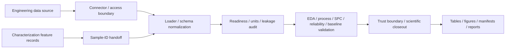

# Materials Data Analyzer

[](https://github.com/jhin0410-lgtm/materials-data-analyzer/actions/workflows/ci.yml)
[](LICENSE)
[](https://www.python.org/)

`materials-data-analyzer` is a CLI-first research software platform for turning
materials, process, quality, reliability, battery, and smart-factory tables into
auditable analysis artifacts with explicit provenance, validation scope, and
scientific claim boundaries.

It is **not a battery-only program**. Battery trajectories are one case-study
family inside a broader Virtual Research Partner for materials and manufacturing
work.

## What the Platform Does

```text
engineering data source
-> source and schema contract
-> readiness, units, identifiers, and leakage audit
-> EDA / process / SPC / reliability / baseline validation
-> trust-boundary and scientific closeout
-> reproducible tables, figures, manifests, and reports
```

The repository supports:

- tabular process and experiment analysis;
- quality, SPC, and smart-factory diagnostics;
- reliability and repeated-asset validation;
- battery cycle and trajectory analysis;
- descriptive materials-property screening;
- group-aware, time-aware, and asset-aware baseline validation;
- data-driven candidate and scenario screening;
- bounded scientific checks and compact provenance artifacts;
- explicit process–characterization integration by `sample_id`.

The companion
[`materials-characterization-analyzer`](https://github.com/jhin0410-lgtm/materials-characterization-analyzer)
owns instrument-specific XRD, SEM, EDS, Raman, TEM, and SAED feature extraction.
The two repositories remain independently installable and exchange versioned
files rather than importing each other's internal modules.

## Architecture



Responsibilities are separated deliberately:

- `src/connectors/`: source discovery and access boundaries;
- `src/loaders/`: parsing, normalization, and handoff contracts;
- `src/analyzers/`: statistical analysis, validation, and diagnostics;
- `src/platform_core/`: registries, provenance, scientific contracts, and
  bounded platform workflows;
- `scripts/`: case-study orchestration;
- `data/case_studies/`: source notes, compact real-data tables, and scientific
  limitations;
- `outputs/`: regenerable local artifacts that are not committed.

## Quickstart

### 1. Install

```powershell
python -m venv .venv
.\.venv\Scripts\Activate.ps1
python -m pip install --upgrade pip
python -m pip install -r requirements.txt
```

### 2. Run a synthetic process example

```powershell
python src/process_data.py `
  --mode process `
  --input data/sample/experiment_process.csv `
  --target yield_percent `
  --goal maximize `
  --run-name demo_process
```

### 3. Run SPC

```powershell
python src/process_data.py `
  --mode spc `
  --input data/sample/factory_log.csv `
  --target temperature_c `
  --lsl 690 `
  --usl 710 `
  --run-name demo_spc
```

### 4. Run reliability analysis

```powershell
python src/process_data.py `
  --mode reliability `
  --input data/sample/experiment_reliability.csv `
  --run-name demo_reliability
```

### 5. Run candidate-condition screening

```powershell
python src/process_data.py `
  --mode simulation `
  --input data/sample/experiment_process.csv `
  --target yield_percent `
  --features process_temp_c process_time_min pressure_mpa thickness_um `
  --scenario-input data/sample/candidate_conditions.csv `
  --goal maximize `
  --run-name demo_screening
```

Simulation mode is a data-driven screening aid, not a physics simulator or an
authority for final process decisions.

## Representative Real Process–Characterization Case Study

The NIST AM-Bench 2018-02 example connects ten IN625 AMMT laser traces to
source-reported optical-microscopy melt-pool width and depth measurements.

```powershell
python scripts/build_nist_ambench_2018_02_case_study.py `
  --output outputs/nist_ambench_2018_02
```

The workflow:

1. validates explicit trace and sample identities;
2. preserves NIST's corrected actual laser powers;
3. converts four optical-metrology measurements per trace into the stable
   characterization feature contract;
4. joins all ten traces through `sample_id`;
5. verifies the source-reported rounded case summaries;
6. writes integrated tables, two plots, a report, and a provenance manifest;
7. intentionally performs no model training or optimization.

The scientific result is **diagnostic**. Ten traces and three coupled power-speed
conditions do not support causal attribution, predictive generalization, or
process optimization.

See
[`data/case_studies/nist_ambench_2018_02/README.md`](data/case_studies/nist_ambench_2018_02/README.md).

## Characterization Feature Handoff

The handoff consumes long-format feature CSVs exported by the characterization
repository and prepares one-row-per-sample tables for process, quality,
reliability, or modeling workflows.

```powershell
python scripts/build_characterization_handoff.py `
  --characterization data/sample/synthetic_characterization_features_long.csv `
  --process-table data/sample/synthetic_process_characterization_samples.csv `
  --output outputs/characterization_handoff_demo
```

Required feature columns:

```text
sample_id
measurement_id
instrument
feature_name
feature_label
value
unit
method
source_file
source_sha256
preprocessing_id
quality_flag
```

The handoff rejects ambiguous measurement mappings, mixed methods, mixed
preprocessing, duplicate semantic features, and duplicate process-table sample
IDs. It never joins by row order and never silently averages repeated
measurements.

See [`docs/CHARACTERIZATION_FEATURE_HANDOFF.md`](docs/CHARACTERIZATION_FEATURE_HANDOFF.md).

## Real-Data Case Studies

| Domain | Dataset or source | Main validation emphasis | Current claim boundary |
| --- | --- | --- | --- |
| Process + characterization | NIST AM-Bench 2018-02 IN625 AMMT traces | Explicit trace identity, source-table reproduction, sample-level handoff | Diagnostic description only; no optimization or predictive claim |
| Materials properties | Materials Project | Chemical-system and reduced-formula grouping, applicability domain | Reproducible descriptive screening; predictive evidence limited |
| Process quality | UCI SECOM | Chronological validation and random-split optimism | Diagnostic only; no production classifier selected |
| Reliability | Backblaze SMART records | Asset-disjoint and time-aware validation | Diagnostic risk ranking; no RUL or maintenance automation |
| Battery | NASA/Kaggle and Battery Archive | Battery grouping, trajectory quality, source comparability | Descriptive or unsupported predictive results preserved |

These case studies demonstrate reusable workflow boundaries. They are not the
identity of the core platform and are not presented as deployment systems.

## Scientific and Engineering Principles

- Treat every row as a physical measurement with sample, processing, method,
  unit, and provenance context.
- Never infer missing metadata, identifiers, units, preprocessing, or exclusion
  reasons.
- Preserve source values and record every important transformation.
- Fit preprocessing only on training partitions when validation is involved.
- Use group-aware, time-aware, or asset-aware splits when random splitting would
  leak repeated entities or future information.
- Separate software validation from scientific validation.
- Preserve negative, weak, limited, and inconclusive results instead of tuning
  them away.
- Do not convert correlation into causal or mechanistic claims.
- Stop blocked external-source work after one bounded screening stage and move
  to the next ranked source.

Scientific closeouts use four evidence levels:

- **Supported**: sufficiently validated and physically plausible for the stated
  scope;
- **Diagnostic**: a useful pattern exists, but mechanism, causality, or
  generalization is unconfirmed;
- **Inconclusive**: evidence is insufficient;
- **Unsupported**: the evidence does not support the tested hypothesis.

## What This Project Is Not

This repository is not:

- a fully automatic engineering decision system;
- a production-quality monitoring or maintenance service;
- a general-purpose AutoML platform;
- a general PDE, DFT, FEM, or CFD solver;
- a production battery degradation or RUL model;
- a raw-data redistribution repository;
- a substitute for instrument calibration, experimental review, or domain
  expertise.

## Repository Structure

```text
src/                  core analyzers, loaders, connectors, and platform code
scripts/              reproducible workflow entry points
configs/examples/     sanitized configuration examples
data/sample/          synthetic examples for tests and quickstarts
data/case_studies/    real-data source notes and compact reproducible inputs
data/processed/       compact tracked summaries and selected derivatives
outputs/              local regenerable outputs; ignored by Git
docs/                 architecture, methods, trust boundaries, and release notes
tests/                unit, integration, contract, and clean-checkout tests
```

See [`docs/PROJECT_STRUCTURE.md`](docs/PROJECT_STRUCTURE.md) and
[`docs/PLATFORM_DIRECTION_RESET.md`](docs/PLATFORM_DIRECTION_RESET.md).

## Testing

Run the full suite:

```powershell
python -m pytest -q
```

On Windows:

```powershell
powershell -ExecutionPolicy Bypass -File scripts/run_tests.ps1
```

The tracked test suite is designed to run without local raw datasets, private
credentials, downloaded archives, or previously generated `outputs/` folders.
Passing tests establishes software behavior, not scientific validity.

## Data, Security, and Public-Repository Policy

Raw downloaded datasets, proprietary instrument exports, credentials, local
registries, row-level predictions, and generated outputs must not be committed.
External datasets retain their own licenses and attribution requirements; the
root MIT license does not relicense third-party data or publications.

See:

- [`data/raw/README.md`](data/raw/README.md)
- [`SECURITY.md`](SECURITY.md)
- [`CONTRIBUTING.md`](CONTRIBUTING.md)
- [pull request template](.github/pull_request_template.md)

## Documentation

Useful entry points:

- [`docs/PORTFOLIO_OVERVIEW.md`](docs/PORTFOLIO_OVERVIEW.md)
- [`docs/CHARACTERIZATION_FEATURE_HANDOFF.md`](docs/CHARACTERIZATION_FEATURE_HANDOFF.md)
- [`docs/PLATFORM_DIRECTION_RESET.md`](docs/PLATFORM_DIRECTION_RESET.md)
- [`docs/SCIENTIFIC_TRUST_BOUNDARY.md`](docs/SCIENTIFIC_TRUST_BOUNDARY.md)
- [`docs/PGIR_MODEL_CONTRACT.md`](docs/PGIR_MODEL_CONTRACT.md)
- [`docs/BATTERY_GENERALIZATION_FORECASTING.md`](docs/BATTERY_GENERALIZATION_FORECASTING.md)

## License

Original code and original documentation in this repository are available under
the [MIT License](LICENSE).

External datasets, publications, standards, and third-party software remain
subject to their own licenses, terms of use, and citation requirements.
