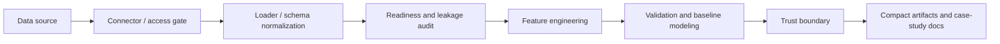

# Portfolio Overview

`materials_data_analyzer` is a CLI-first engineering-data analysis framework
for provenance, readiness checks, leakage-aware validation, and bounded
scientific claims.

The project is intentionally not an AutoML platform, production decision
system, raw data repository, or physics simulator. Its portfolio value is in
turning messy tabular engineering datasets into auditable analysis artifacts
with explicit validation scope and conservative interpretation.

## Engineering Problem

Engineering datasets often arrive as CSV-like tables with unclear provenance,
missing source contracts, repeated observations, temporal dependence, hidden
group structure, target leakage risks, and ambiguous claim boundaries. This
project treats those issues as first-class analysis outputs rather than cleanup
details.

## Architecture

The repository keeps these responsibilities separate:

- connectors: source access, inventory, and provenance boundaries
- loaders: file parsing, schema harmonization, and analysis-ready tables
- analyzers: validation, model diagnostics, and trust-boundary summaries
- scripts: workflow orchestration for case studies
- `data/processed/`: compact tracked summaries and local-only generated tables
- `outputs/`: regenerable local run outputs

v2.0 adds a common platform layer around those responsibilities: explicit
registries, manifest-first dry runs, one controlled read-only Reliability trust
verification path, metadata-only onboarding checks, and local-only
JSON/Markdown platform reporting. v2.1 adds persistent run/artifact lineage,
policy diagnostics, bounded scientific execution, scientific trust boundaries,
and metadata-only feature eligibility. It does not turn the project into an
automatic training, physics-aware modeling, or production execution system.

## Completed Case Studies

| Release | Case study | Dataset | Focus | Result boundary |
| --- | --- | --- | --- | --- |
| v0.8 | Kaggle NASA Battery | Cleaned battery metadata and raw discharge CSVs | Capacity-retention analysis and group-aware simulation | Within-battery diagnostic interpolation; limited unseen-battery generalization |
| v1.1 | Battery Archive | Cycle-data CSVs in raw zip archives | Cycle normalization, capacity retention, threshold proxies | Descriptive cycle-data case study; no forecasting/RUL claim |
| v1.2 / v1.3 | Materials Project | Computed-property tables | Descriptive screening and composition-only validation | Screening reproducible; predictive validation weak |
| v1.4 | Smart Factory / UCI SECOM | Semiconductor process data | Time-aware quality classification | Diagnostic-only; no representative production model |
| v1.5 | Reliability / Backblaze | 2013 hard-drive daily SMART records | Asset/time-aware 7-day failure-risk ranking | Diagnostic-only; no representative model |

For the Backblaze v1.5 closeout, the best primary median PR-AUC is 0.0998 and
the best combined asset/time PR-AUC is 0.1119. The reference combined top 1%
precision/lift/failed-asset capture is 0.0703 / 62.9x / 0.846, but no
representative model is selected.

## Technical Highlights

- Data contracts for source, schema, target, leakage, validation, and claims
- Streaming archive processing for large Backblaze daily CSV files
- Train-only preprocessing and split-aware validation utilities
- Group-aware validation for batteries and materials
- Time-aware validation for process quality and asset reliability
- Asset-disjoint and combined asset/time validation for repeated drive histories
- Rare-event metrics, top-risk diagnostics, and threshold boundary reporting
- Deterministic compact artifacts that can be tested in clean clones without
  raw data
- Persistent local registry metadata for lineage, diagnostics, scientific
  findings, trust boundaries, and feature-candidate eligibility

## Scientific Rigor

The project does not treat a high random-split score as enough evidence. Each
case study separates optimistic references from the validation design that
matches the intended claim:

- battery-level grouping for unseen-battery generalization
- chemical-system grouping for unseen-material-family validation
- chronological validation for process-quality drift
- asset-disjoint and combined asset/time validation for reliability data

Negative or limited results are preserved. For example, the Materials Project
composition-only model and the Smart Factory process-quality classifier both
remain within conservative trust boundaries. The Backblaze v1.5 case study
shows top-risk concentration but still selects no representative model because
of repeated-origin dependence, resource-limited training, uncertain censoring,
and lack of external validation.

## Data Governance

Raw datasets, downloaded archives, row-level predictions, local credentials,
and generated `outputs/` folders are not committed. The repository tracks
compact contracts, manifests, inventories, summary tables, methodology notes,
and tests.

This makes the public repository useful for review without redistributing large
or license-sensitive source files.

## Testing and CI

The project has a broad pytest suite covering core analyzers, loaders,
connectors, feature engineering, validation utilities, scripts, platform
registries, scientific execution, and case-study artifact contracts. The v2.1
release audit passed 594 tests with 2 existing skips locally, through direct
pytest, and in a clean tracked snapshot; GitHub Actions validates the release
branch on Python 3.11.

## Skills Demonstrated

- Python and pandas for tabular engineering data
- scikit-learn baseline modeling and metric reporting
- Data contracts, schema validation, and provenance manifests
- Streaming/chunked processing for large archives
- Feature engineering with cutoff-safe temporal windows
- Time-aware, group-aware, and asset-disjoint validation
- Rare-event evaluation and top-risk diagnostics
- Reproducible artifact generation
- Pytest coverage for local and clean-checkout workflows
- Git, GitHub Actions, release documentation, and conservative scientific
  communication

## Limitations

- The project is CLI-first and does not include a production UI.
- Case-study outputs are retrospective and should not be treated as deployment
  systems.
- Backblaze v1.5 does not provide calibrated failure probabilities, survival
  estimates, RUL predictions, or maintenance automation.
- Advanced physics-aware materials descriptors, graph neural networks, and SHAP
  are intentionally deferred until baseline validity and claim scope justify
  them.

## Next-Generation Roadmap

v2.2 should build on the platform structure rather than stronger claims:

- bounded Materials composition feature builders with leakage-aware validation
- XRD characterization feature adapters for d-spacing and crystallite-size
  estimates without phase-identification claims
- baseline-vs-feature comparisons under group/time validation
- explicit model-input evidence before any physics-aware predictive claim

Physics-aware materials modeling and more advanced explainability should remain
later v2.x work and should only be applied to models that clear the relevant
validation gates.
