# Portfolio Overview

`materials-data-analyzer` is an installable, CLI-first engineering-data analysis
framework for provenance, readiness checks, leakage-aware validation,
constraint-aware candidate screening, and bounded scientific claims.

The project is intentionally not an AutoML platform, production decision system,
raw-data repository, or general physics simulator. Its portfolio value is in
turning messy tabular engineering datasets into auditable analysis artifacts
with explicit validation scope and conservative interpretation.

## Engineering Problem

Engineering datasets often arrive as CSV-like tables with unclear provenance,
ambiguous headers, silent dtype conversion, repeated observations, temporal
dependence, hidden group structure, target leakage risks, and unclear claim
boundaries.

This project treats those issues as analysis outputs rather than cleanup details.
A successful run must show what was changed, what evidence was used, what the
validation design supports, and what remains unsuitable for engineering or
scientific claims.

## User-Facing Product

The stable user interface is the installed `mda` command:

```powershell
python -m pip install -e ".[dev]"
mda --help
```

Supported user modes include:

- EDA;
- process-condition analysis;
- SPC;
- reliability analysis;
- Smart Factory diagnostics;
- surrogate candidate screening.

Each run writes a preprocessing audit and run manifest. Ambiguous normalized
headers fail closed, non-empty output directories are protected from silent
overwrite, and candidate predictions outside the observed training range are not
included in the final ranking.

Case-study scripts remain explicit user workflows. `python -m src.cli` is an
internal registry, PGIR, scientific-governance, and evidence-management
interface rather than the primary user product.

## Architecture

```mermaid
flowchart LR
    source["Data source"] --> connector["Connector / access gate"]
    connector --> loader["Loader / schema normalization"]
    loader --> preprocessing["Preprocessing audit"]
    preprocessing --> readiness["Readiness and leakage audit"]
    readiness --> features["Feature engineering"]
    features --> validation["Validation and baseline modeling"]
    validation --> eligibility["Candidate eligibility"]
    eligibility --> trust["Trust boundary"]
    trust --> artifacts["Tables, figures, manifests, and reports"]
```



Responsibilities remain separated:

- connectors: source access, inventory, and provenance boundaries;
- loaders: file parsing, schema harmonization, and analysis-ready tables;
- analyzers: validation, model diagnostics, and candidate eligibility;
- platform core: scientific contracts, registries, trust, and evidence metadata;
- scripts: reproducible real-data and release-governance workflows;
- `data/processed/`: compact tracked summaries;
- `outputs/`: local regenerable run artifacts.

## Representative End-to-End Workflow

The primary representative workflow uses NIST AM-Bench 2018-02 IN625 data:

```text
tracked process and optical-metrology tables
-> explicit trace and sample identity
-> 40 provenance-bearing characterization feature rows
-> 10 one-to-one sample joins
-> source-summary and checksum verification
-> process-design identifiability audit
-> minimum next-experiment plan
-> Diagnostic scientific closeout
```

The workflow does not train a response model. Ten traces and three coupled
power-speed conditions cover only three of six combinations in the observed
2 x 3 grid. They do not identify independent power and speed effects,
interaction, curvature, prediction, or an optimum.

The bounded next action is to complete the missing factorial combinations with
independently traceable replicates, not to add a more complicated model.

## Completed Case Studies

| Area | Dataset | Validation emphasis | Result boundary |
| --- | --- | --- | --- |
| Process + characterization | NIST AM-Bench 2018-02 | Sample identity, source reproduction, design identifiability | Diagnostic; no prediction or optimization |
| Battery | Kaggle NASA Battery | Battery-disjoint warm-start forecast | Unsupported; Ridge worse than persistence |
| Battery | Battery Archive | Cycle normalization and censoring | Descriptive; no RUL or forecasting claim |
| Materials | Materials Project | Chemical-system grouping and applicability domain | Descriptive screening; predictive evidence limited |
| Smart Factory | UCI SECOM | Chronological validation and random-split optimism | Diagnostic; no production classifier |
| Reliability | Backblaze | Asset-disjoint and time-aware validation | Diagnostic risk ranking; no RUL or maintenance automation |

## Scientific Results Preserved

The repository keeps negative and limited results rather than tuning them away.
Important current closeouts include:

- Materials composition physics feature comparison: `performance_degraded`;
- known-structure predictive value: `structure_predictive_value_limited`;
- representative Materials model: none selected;
- Battery Ridge pooled MAE: `4.1537`;
- Battery persistence pooled MAE: `3.4256`;
- Ridge improvement: 13 of 33 evaluated batteries;
- Battery predictive-validation readiness: `not_ready`;
- Battery external-evidence closeout: **Inconclusive**;
- NIST process-characterization workflow: **Diagnostic**;
- NIST predictive or causal readiness: blocked.

These results demonstrate scientific discipline. They are not product-performance
claims.

## Candidate Screening Safety

The simulation mode remains a surrogate screening aid. The final eligibility
layer now distinguishes:

- valid and rankable candidates;
- invalid rows with missing required features;
- candidates outside observed training feature ranges;
- candidates violating source-backed equipment, material, or safety constraints.

Optional constraint files support only fixed `range`, `allowed_values`, and
`conditional_range` records. Arbitrary expression execution is prohibited.
Original unconstrained outputs remain preserved for provenance, while the final
ranking includes only eligible candidates.

This does not create calibrated uncertainty, multivariate causal validity, or
machine-operating approval.

## Provenance and Reproducibility

Every stable analysis run records:

- input path and SHA-256;
- platform version;
- original and normalized column names;
- dtype changes and numeric coercion failures;
- missing values introduced by preprocessing;
- rows removed as fully empty;
- command options and overwrite request;
- generated output paths.

Run folders fail closed when non-empty unless complete replacement is explicitly
requested. This prevents results from different executions being silently mixed.

## Packaging and CI

The repository includes Python package metadata, a wheel and source-distribution
build, and the `mda` console entry point. CI performs:

- complete pytest execution on Ubuntu and Windows;
- full-history release-boundary regression checks;
- wheel and source-distribution build;
- installed-wheel import check;
- installed `mda` command smoke analysis;
- artifact upload for test and package diagnostics.

The exact current pass count is intentionally not hard-coded in this document.
The GitHub Actions run attached to the reviewed commit is the source of truth.
Passing software tests does not establish sample comparability, instrument
calibration, causal validity, predictive generalization, or engineering release.

## Technical Skills Demonstrated

- Python and pandas for engineering tabular data;
- scikit-learn baseline modeling and metric reporting;
- source, schema, preprocessing, target, leakage, and claim contracts;
- group-aware, time-aware, and asset-disjoint validation;
- rare-event and top-risk diagnostics;
- deterministic artifacts and SHA-256 manifests;
- safe JSON constraint evaluation without arbitrary code execution;
- package build and installed CLI validation;
- Windows and Linux CI;
- cross-repository versioned data handoffs;
- conservative scientific communication.

## Data Governance

Raw datasets, downloaded archives, row-level predictions, local credentials, and
generated output folders are not committed. The repository tracks compact
contracts, manifests, inventories, summary tables, methodology notes, and tests.

The MIT license applies to original code and documentation. It does not relicense
third-party datasets, publications, standards, or instrument exports.

## Current Limitation

The main remaining limitation is not missing model complexity. It is the lack of
a user-controlled real dataset that carries defensible sample identity,
composition, process history, characterization, and outcome metadata through one
complete workflow.

The highest-value next case study is therefore a small compatible experimental
dataset with explicit identifiers and conditions. When the experimental design
is insufficient, the software should identify the narrowest useful next
measurement or experiment rather than force a predictive result.
